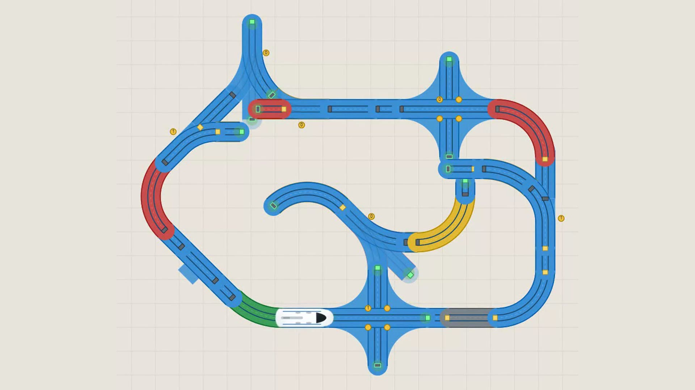
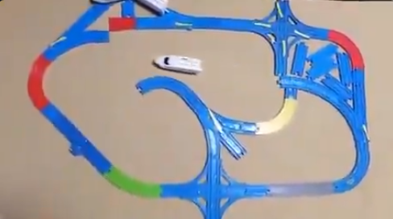
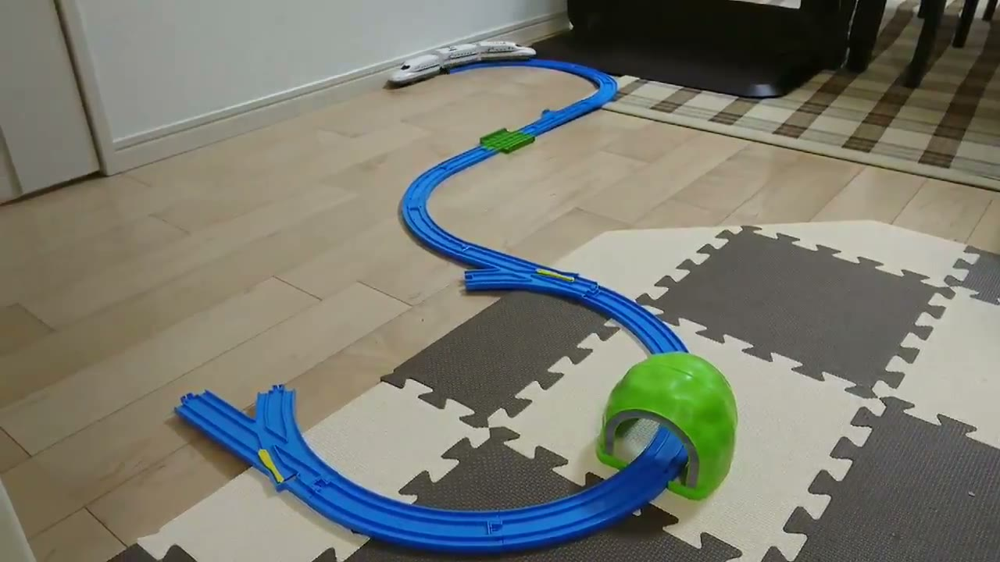
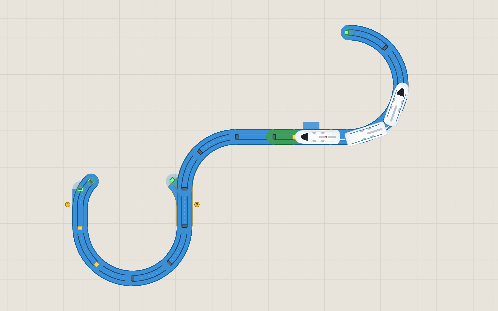

# Plarail Meme — Real-2-Sim

[](LICENSE)
[](https://putersdcat.github.io/PlarailMemeDemo/?track=real-meme)

[](https://putersdcat.github.io/PlarailMemeDemo/?track=real-meme)

**[▶ Play Real-2-Sim meme track](https://putersdcat.github.io/PlarailMemeDemo/?track=real-meme)** ·
**[▶ Play aren't enough rails (godi3)](https://putersdcat.github.io/PlarailMemeDemo/?track=arent-enough-rails)** ·
**[1080p video](recordings/plarail-meme-demo-1080p.mp4)** ·
**[480p video](recordings/plarail-meme-demo-480p.mp4)**

## Inspiration

The layout and vibe come from this meme / layout energy (the primal pitch deck):

[](docs/InspirationScreenshot.png)

> [how my codebase written entirely with claude code runs](https://t.co/sPDmqn63I2)
> — Markov ([@MarkovMagnifico](https://x.com/MarkovMagnifico)), 18 Jan 2026

**[▶ Open this track in the live demo](https://putersdcat.github.io/PlarailMemeDemo/?track=real-meme)**

## aren't enough rails (godi3)

A second built-in layout, from this 2017 clip of a train leaving the rails because — well — there aren't enough rails:

[](https://x.com/godi3/status/945956752515670016?s=20)

> [レールが足りないので。](https://x.com/godi3/status/945956752515670016?s=20)
> — ごぢ ([@godi3](https://x.com/godi3)), 27 Dec 2017

The sim version is a sparse open-C with a three-car consist (active engine, mid, reverse-facing passive engine) and solid playfield walls, so the derail is the point: floor-glide the gap, then recapture at an open mouth.

[](https://putersdcat.github.io/PlarailMemeDemo/?track=arent-enough-rails)

**[▶ Play aren't enough rails (godi3)](https://putersdcat.github.io/PlarailMemeDemo/?track=arent-enough-rails)**

Deep links use `?track=` (alias `?layout=`) and skip whatever is in localStorage so the README URL always opens that catalog entry:

| Track | Live URL |
| --- | --- |
| Real-2-Sim meme track | [https://putersdcat.github.io/PlarailMemeDemo/?track=real-meme](https://putersdcat.github.io/PlarailMemeDemo/?track=real-meme) |
| aren't enough rails (godi3) | [https://putersdcat.github.io/PlarailMemeDemo/?track=arent-enough-rails](https://putersdcat.github.io/PlarailMemeDemo/?track=arent-enough-rails) |

Accepted slugs include `real-meme`, `meme`, `arntenoughrails`, `arent-enough-rails`, `aren't-enough-rails`, and `godi3`.

## Develop Please it's buggy slop!

```bash
npm test          # node tests/run.mjs
npm run serve     # python -m http.server 8765
npm run trace:train -- --frames=500  # backend train telemetry trace
```

Hard-refresh after JS changes (cache-busted `?v=` on entry assets).

### Portable handoff patch

When this working tree cannot be committed or pushed, create one flat patch file containing both tracked changes and non-ignored new files:

````powershell
npm run export:patch
````

The default output is `portable-plarail.patch` in the repository root. To choose another path through npm on Windows, pass it positionally:

````powershell
npm run export:patch -- portable-plarail.patch
````

Copy `portable-plarail.patch` to the target checkout, review it first, then apply it from that repository's root:

````powershell
git apply --check --binary .\portable-plarail.patch
git apply --3way --binary --whitespace=fix .\portable-plarail.patch
````

The exporter compares the working tree with `HEAD`, includes staged and unstaged changes, preserves binary diffs, and intentionally excludes ignored files and the generated patch itself. If the target checkout starts from another ref, run the script directly with `--base=<ref>`, for example `node scripts/export-portable-diff.mjs --base=master --out=portable-plarail.patch`.

### Physics telemetry

Open the browser with `?debug=1` to record frame-by-frame train telemetry.
Add `?track=real-meme` or `?track=arent-enough-rails` to force a built-in
layout (skips autosave). Add `?lang=ja` or `?lang=en` to preview a language
without depending on the browser locale (🇺🇸 / 🇯🇵 in the UI overrides and
remembers the choice). The live hooks are available as
`window.__sim.getTelemetry()` and `window.__plarailDemo.getTelemetry()` for
Playwright or the developer console. The backend equivalent is
`npm run trace:train`; add `--out=<file>` to save the complete JSON trace
instead of only the compact event summary.

## Thanks

Endless thanks to my wife **Denise** — for patience, floor space, and not declaring the living room a staging environment.

Thank you, **Japan**, for inventing (and endlessly iterating) the plastic rail universe that made childhood and this repo possible.

Dimensional and structural reality checks were made possible by the excellent community references at Parlorfleur:

- [Normal Rail](https://parlorfleur-pm.com/Normal_Rail.html)
- [Rail Structure List](https://parlorfleur-pm.com/Rail_Structure_List.html)

And by the internet’s long memory — the Internet Archive’s Plarail catalog scan:

- [Plarail Catalogue 2014 (archive.org)](https://archive.org/details/catalogue-plarail-catalogue-2014_202208/%5Bcatalogue%5D_plarail_catalogue_2014/page/n9/mode/2up)

If you measured a curve with a ruler at 1 a.m. so a stranger on the web wouldn’t have to: you’re the real unit of track.

## Intro (synergistic rail-forward value proposition)

In today’s rapidly evolving multi-modal plastic ecosystem, stakeholders increasingly demand a **holistic end-to-end train-shaped experience** that empowers builders to *leverage* magnetic adjacency, *unlock* paint-adjacent brand moments, and *operationalize* derailment as a first-class citizen of the joy funnel.

**Plarail Meme — Real-2-Sim** is not merely a simulator. It is a paradigm-shifting **spatial narrative continuum** wherein a white bullet-adjacent locomotion unit traverses a graph of emotionally resonant connectors, occasionally exiting the rails in a deliberate act of floor-native disruption, then re-onboarding via geometrically consenting mouths. Our north-star OKR is simple: make the train go brrr, then make it go *fshhh* along the outer wall, then make it go brrr again, in a closed-loop feedback cycle of delight.

We ship zero runtime npm dependencies because we believe true innovation means **owning the full stack of vibes** — Canvas pixels, Web Audio coffee-grinder sonics, and localStorage as a lightweight CRM for your personal track estate. If it compiles in your brain at 2 a.m., it ships.

## Backstory (origins, but make it enterprise)

Long ago (in product time: last week), a sacred artifact appeared on the timeline: a dense blue layout, a lonely engine, and a caption about codebases that run exclusively on pure LLM energy. The internet, as is its custom, laughed, then asked *what if we productized the bit*.

Thus began a multi-sprint journey of **agentic pair-programming at scale**. Requirements were harvested from the collective unconscious:

- “Snap should feel sticky but not *too* sticky (unless we mean walls, then unsticky the stick).”
- “Motor sound: plastic gears, not a leaf blower possessed by a tuba.”
- “Train bigger. No, longer. Nose like airplane. Windshield like moon. Remove the orange circle that was definitely intentional.”
- “Also yellow paint. And publish it.”

Through countless iterations of *yes-and* refinement, a team of silicon interns (and one human who still has to click Hard Refresh) co-authored a living digital twin of childhood floor logistics. Gendered connectors found true love. Switches found purpose. The front virtual axle found religion, lost it, found it again at offset `+8`. Wall bounce was briefly a lifestyle, then a regression, then a frozen physics constant so the elongated body art would stop gaslighting the collision system.

Today we open-source this artifact under MIT, not because we must, but because **community is the real unit of track**. Fork it. Paint it gray. Drive it off the red dashed abyss of the canvas and call it a controlled experiment.

> *“We didn’t invent Plarail. We merely midwifed its memetic digital shadow into a browser tab.”*  
> — Generated in a meeting that never happened

---

## What it actually is (human translation)

Browser simulation of a Takara Tomy **Plarail**-style track set: magnetic snap building, paint colors, a white bullet engine that follows rails, derails at open ends, slides along plastic walls with a coffee-grinder motor, and re-rails when geometry allows.

**No build step, no npm runtime deps** — plain HTML + ES modules + Canvas + Web Audio.

## Play online

### [▶ Open the Real-2-Sim meme track](https://putersdcat.github.io/PlarailMemeDemo/?track=real-meme)

### [▶ Open aren't enough rails (godi3)](https://putersdcat.github.io/PlarailMemeDemo/?track=arent-enough-rails)

Serve locally if you prefer:

```bash
# from the repo root
python -m http.server 8765
# or: npm run serve
```

Then open [http://127.0.0.1:8765/](http://127.0.0.1:8765/) or a deep link such as [http://127.0.0.1:8765/?track=arent-enough-rails](http://127.0.0.1:8765/?track=arent-enough-rails).

## License

[MIT](LICENSE) © 2026 Eric Anderson

Plarail is a trademark of Takara Tomy. This is an unofficial fan demo and is not affiliated with Takara Tomy.
